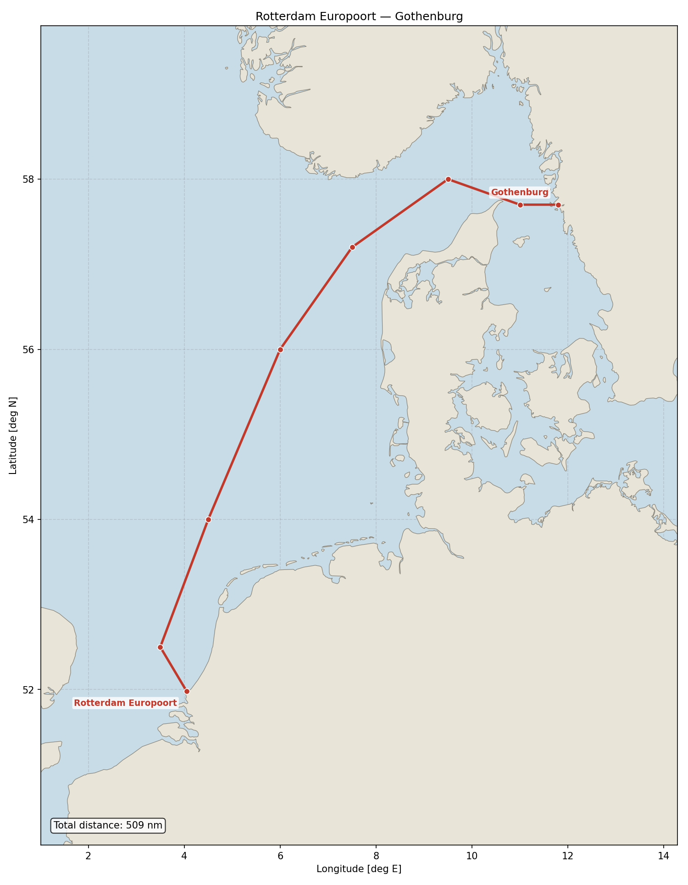
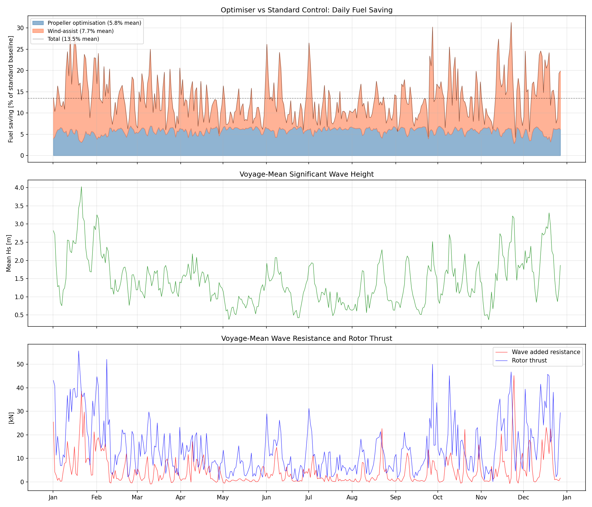
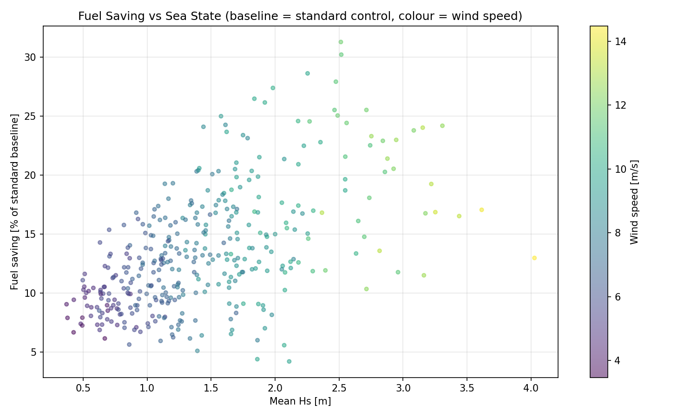
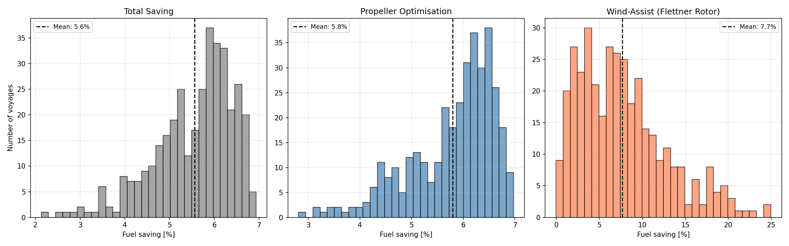
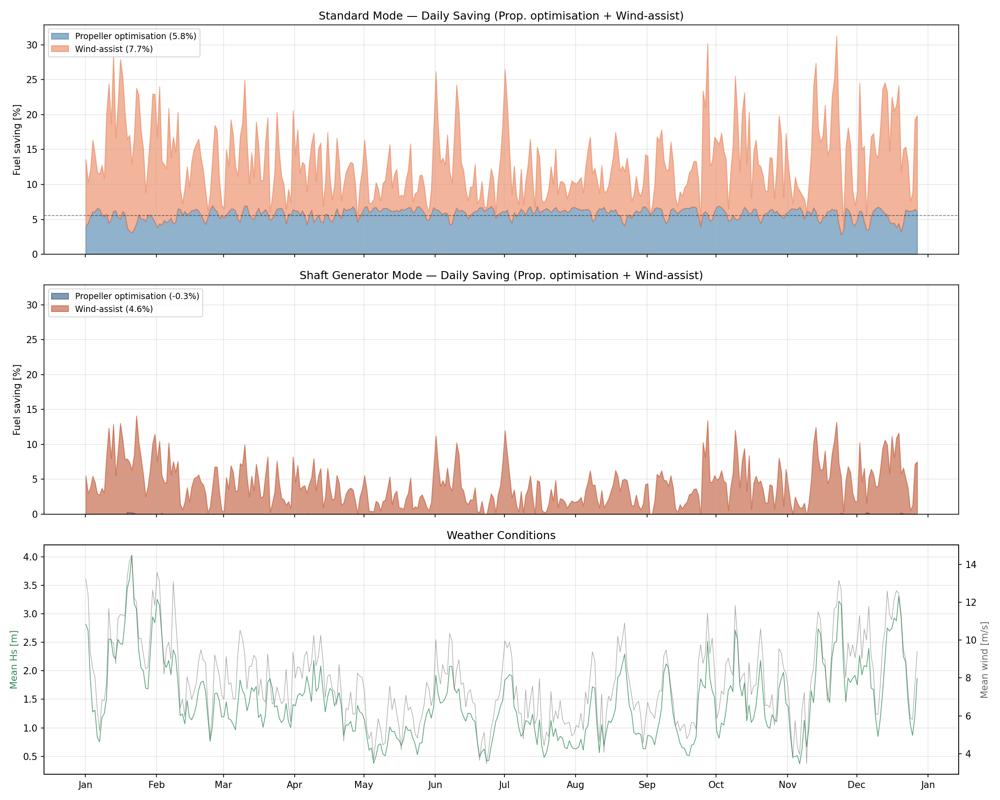

#+TITLE:
#+OPTIONS: title:nil toc:nil num:t H:3 ^:{}
#+LATEX_CLASS: article
#+LATEX_CLASS_OPTIONS: [a4paper,11pt]
#+LATEX_HEADER: % --- Document metadata (must precede bv.sty which uses them in \hypersetup) ---
#+LATEX_HEADER: \newcommand{\bvReferenceNumber}{XXXXXX}
#+LATEX_HEADER: \newcommand{\bvIssue}{Pre}
#+LATEX_HEADER: \newcommand{\bvTitle}{Propulsion Optimiser -- Fuel Saving Potential}
#+LATEX_HEADER: \newcommand{\bvDate}{\today}
#+LATEX_HEADER: \newcommand{\bvType}{Technical Report}
#+LATEX_HEADER: \newcommand{\bvAuthor}{Frode Bloch}
#+LATEX_HEADER: \newcommand{\bvCompany}{Brunvoll AS}
#+LATEX_HEADER: \newcommand{\bvClassification}{CONFIDENTIAL}
#+LATEX_HEADER: \usepackage{/home/blofro/src/rdt_analysis/bv}
#+LATEX_HEADER: \usepackage{siunitx}
#+LATEX_HEADER: \sisetup{per-mode=symbol, inter-unit-product=\ensuremath{\cdot}}
#+LATEX_HEADER: \DeclareSIUnit{\knot}{kn}
#+LATEX_HEADER: \usepackage{amsmath}
#+LATEX_HEADER: \usepackage{subcaption}
#+LATEX_HEADER: \usepackage{eurosym}
#+LATEX_HEADER: \graphicspath{{images/}}

#+BEGIN_EXPORT latex
\bvMainTitlePage
\tableofcontents
\newpage
#+END_EXPORT

* Introduction

This report presents fuel saving results from Brunvoll's voyage fuel
simulation tool, developed to quantify the potential of the *Propulsion
Optimiser* -- our smart propeller control system.  The analysis also evaluates
the combined benefit when the Propulsion Optimiser is paired with *Flettner
rotor wind-assist*, as the two technologies are complementary: the Optimiser
improves engine efficiency at every operating point, while the Flettner rotor
reduces the thrust demand itself by harnessing wind energy.  Together, they
address different parts of the propulsion energy chain and their savings add
up.

- *The Propulsion Optimiser* (referred to as "Optimiser" in the rest of this
  report) -- finds the most fuel-efficient propeller pitch/RPM combination for
  any given condition, replacing the standard (factory-default) propeller
  control schedule.

- *Flettner rotor wind-assist* -- a spinning cylinder mounted on deck that
  generates forward thrust via the Magnus effect, reducing the load on the main
  engine.

To evaluate these technologies under realistic conditions, we simulate a full
year (2024) of repeated voyages on a representative North Sea route
(Rotterdam--Gothenburg, 509 nm), using actual historical weather data.  Each
voyage experiences the real waves and winds that occurred on that date, giving
a comprehensive picture of fuel savings across all seasons and weather
conditions.

** What We Compare

The simulation runs every voyage under four configurations:

#+ATTR_LATEX: :booktabs t :align lp{8cm}
| Configuration                     | Description                                                                   |
|-----------------------------------+-------------------------------------------------------------------------------|
| Standard control, no rotor        | Factory-default propeller schedule, no wind-assist -- the baseline            |
| Standard control + Flettner rotor | Factory schedule with wind-assist thrust from the rotor                       |
| Optimiser, no rotor               | Fuel-optimised pitch/RPM selection, no wind-assist                            |
| Optimiser + Flettner rotor        | Fuel-optimised pitch/RPM combined with wind-assist -- the full-benefit case   |

Fuel savings are always measured relative to the baseline (standard control, no
rotor), and are decomposed into:
- *Propeller optimisation saving* -- the Optimiser's benefit from smarter pitch/RPM selection, independent of weather.
- *Wind-assist saving* -- the additional benefit from the Flettner rotor, which grows with wind speed.

* How the Simulation Works
** Hull Resistance and Propulsion

The simulation models the vessel's propulsion chain from hull resistance through
to engine fuel consumption:

- *Calm-water resistance* is based on the vessel's service prediction data
  (model test results), covering speeds from 8 to 15.5 knots.
- *Wave added resistance* is computed using hydrodynamic transfer functions
  specific to the hull shape, integrated over the wave spectrum at each time
  step.  In simple terms: the tool calculates how much extra drag the waves
  create based on their height, period, and direction relative to the vessel.
- *Wind resistance on the hull* follows the established Blendermann (1994)
  method, accounting for wind speed and direction relative to the vessel.
  Headwinds add resistance; following winds reduce it.
- *Hull and propeller fouling* can be included as time-dependent roughness
  growth.  The baseline results shown here assume clean hull and propeller
  conditions.

** Flettner Rotor Wind-Assist

The Flettner rotor is a spinning vertical cylinder (\SI{28}{\metre} tall,
\SI{4}{\metre} diameter) that exploits the Magnus effect: when wind flows past
the spinning rotor, it generates a sideways force -- much like a spinning ball
curves in flight.  The forward-pointing component of this force acts as free
thrust that supplements the propeller.

The key equation governing the rotor's thrust is:

\begin{equation}
  F_\text{rotor} = C_L(\text{SR}) \cdot \tfrac{1}{2}\,\rho_\text{air}\, V_\text{app}^2 \cdot D \cdot H
\end{equation}

where $C_L$ is the lift coefficient (dependent on the spin ratio SR -- how fast
the rotor spins relative to the wind speed), $V_\text{app}$ is the apparent wind
speed, and $D \times H$ is the rotor's projected area.  The rotor's own motor
power consumption is subtracted to give the net fuel benefit.

The rotor produces the most benefit in beam winds (wind from the side) and
provides diminishing returns in headwinds or following winds.  Its effectiveness
increases with wind speed.

** Standard vs Optimiser Propeller Control

A controllable-pitch propeller (CPP) has two adjustment parameters: blade pitch
and shaft RPM.  The *standard control* uses a fixed schedule that links these
two parameters together -- a single lever controls both, following a pre-set
curve.

The *Optimiser* breaks this rigid link.  For any given thrust requirement, it
searches the full range of pitch and RPM combinations to find the one that
minimises fuel consumption, while respecting the engine's operating limits.
The saving comes from running the engine at a more efficient load point --
typically lower RPM and higher pitch than the standard schedule would dictate.

** Weather Data

The simulation uses wave and wind data from NORA3, the third-generation
Norwegian Reanalysis Archive produced by MET Norway.  This is a high-quality
historical weather reconstruction that provides complete, gap-free wave and wind
fields across the North Sea at approximately \SI{3}{\kilo\metre} spatial
resolution and hourly time steps.

Unlike isolated buoy measurements, this dataset covers the entire route with
consistent quality, ensuring that every simulated voyage encounters realistic
weather conditions.  The archive spans from 1993 to the present, enabling
multi-year studies if needed.

* Simulation Setup

The study simulates a full year of round-trip voyages on the route shown in
Figure [[fig:route]].

#+ATTR_LATEX: :booktabs t :align lll
| Parameter              | Value              | Unit          |
|------------------------+--------------------+---------------|
| Route                  | 509                | nm (one-way)  |
| Transit speed          | 10                 | kn            |
| Transit time (one-way) | 50.9               | hours         |
| Mode                   | Round-trip         |               |
| Flettner rotor         | 28 m tall, 4 m dia |               |
| Hull condition         | Clean (no fouling) |               |
| Port/idle time         | 15                 | @@latex:\%@@  |
| Fuel price (MGO)       | 650                | EUR/tonne     |
| Propeller diameter     | 4.80               | m             |
| Main engine            | MAN L27/38         | 2920 kW       |

Each voyage departs daily, sails the outbound leg, and returns immediately
-- experiencing different weather on each leg.  Round-trip simulation eliminates
any directional wind bias (e.g.\ prevailing westerlies favouring one direction).
With 15@@latex:\%@@ assumed port/idle time, the vessel completes approximately
73 round-trip voyages per year.

#+NAME: fig:route
#+CAPTION: Rotterdam--Gothenburg route (509 nm one-way) with waypoints.
#+ATTR_LATEX: :width 0.85\textwidth :placement [H]

* Results

362 round-trip voyages were successfully simulated across the full year 2024.

** Per-Voyage Fuel Consumption

#+ATTR_LATEX: :booktabs t :align lrrrrrr
| Metric                               |  Mean | Median |   P10 |   P90 |   Min |   Max |
|--------------------------------------+-------+--------+-------+-------+-------+-------|
| Standard, no rotor [kg/voyage]       | 14502 |  14392 | 13297 | 16200 | 10545 | 19300 |
| Optimiser + rotor [kg/voyage]        | 12577 |  12620 | 10614 | 14417 |  8158 | 18030 |
| Propeller optimisation saving [kg]   |   834 |    869 |   721 |   914 |   369 |   928 |
| Wind-assist saving [kg]              |  1091 |    993 |   280 |  2091 |    -9 |  3527 |
| Propeller optimisation saving        | 5.8@@latex:\%@@ | 6.0@@latex:\%@@ | 4.5@@latex:\%@@ | 6.6@@latex:\%@@ | 2.8@@latex:\%@@ | 7.0@@latex:\%@@ |
| Wind-assist saving                   | 7.7@@latex:\%@@ | 6.8@@latex:\%@@ | 1.9@@latex:\%@@ | 14.7@@latex:\%@@ | -0.1@@latex:\%@@ | 25.0@@latex:\%@@ |

Key observations:
- The *propeller optimisation* delivers a consistent 3--7@@latex:\%@@ saving on
  every voyage, regardless of weather.
- The *wind-assist saving* varies from near zero in calm conditions to over
  25@@latex:\%@@ on the windiest voyages, reflecting its weather dependence.
- On the single best voyage, the Flettner rotor alone saved 3.5 tonnes of fuel.

The savings are additive: the combined benefit equals the propeller optimisation
saving plus the wind-assist saving.

Figure [[fig:timeseries]] shows how the savings evolve over the year, alongside
the sea conditions that drive them.

#+NAME: fig:timeseries
#+CAPTION: Annual results per voyage.  Top: propeller optimisation and wind-assist fuel savings (stacked).  Middle: significant wave height.  Bottom: wave resistance, wind resistance, and Flettner rotor thrust.
#+ATTR_LATEX: :width \textwidth :placement [H]

** Weather Correlation

Figure [[fig:scatter]] shows how the fuel saving on each voyage correlates with
wave height and wind speed.  The trend is clear: windier conditions mean larger
savings from the Flettner rotor.

#+NAME: fig:scatter
#+CAPTION: Per-voyage fuel saving vs mean wave height, coloured by mean wind speed.  Windier conditions produce larger savings through the Flettner rotor.
#+ATTR_LATEX: :width 0.85\textwidth :placement [H]

** Annualised Fuel Consumption

#+ATTR_LATEX: :booktabs t :align lr
| Configuration                     | Fuel [tonnes/year] |
|-----------------------------------+--------------------|
| Standard control, no rotor        |             1060.5 |
| Standard control + Flettner rotor |              973.7 |
| Optimiser, no rotor               |              999.5 |
| Optimiser + Flettner rotor        |              919.7 |

#+ATTR_LATEX: :booktabs t :align lrr
| Saving component          | Tonnes/year | Percentage          |
|---------------------------+-------------+---------------------|
| Propeller optimisation    |        61.0 | 5.8@@latex:\%@@     |
| Wind-assist (Flettner)    |        79.8 | 7.5@@latex:\%@@     |
| *Combined*                |   *140.8*   | *13.3@@latex:\%@@*  |

Figure [[fig:histogram]] shows the distribution of per-voyage savings.  The
propeller optimisation is tightly clustered (consistent benefit), while the
wind-assist saving shows a wider spread reflecting its dependence on weather.

#+NAME: fig:histogram
#+CAPTION: Distribution of per-voyage fuel savings.  Left: total saving.  Centre: propeller optimisation component.  Right: wind-assist component.
#+ATTR_LATEX: :width \textwidth :placement [H]

** Annual Cost Savings

At a fuel price of @@latex:\euro@@650/tonne (MGO, typical for ECA zones):

#+ATTR_LATEX: :booktabs t :align lr
| Configuration                     | Annual fuel cost                        |
|-----------------------------------+-----------------------------------------|
| Standard control, no rotor        | @@latex:\euro@@689\thinspace318         |
| Standard control + Flettner rotor | @@latex:\euro@@632\thinspace910         |
| Optimiser, no rotor               | @@latex:\euro@@649\thinspace658         |
| Optimiser + Flettner rotor        | @@latex:\euro@@597\thinspace794         |

#+ATTR_LATEX: :booktabs t :align lrr
| Saving component          | @@latex:\euro@@/year             | Percentage          |
|---------------------------+---------------------------------+---------------------|
| Propeller optimisation    | @@latex:\euro@@39\thinspace660  | 5.8@@latex:\%@@     |
| Wind-assist (Flettner)    | @@latex:\euro@@51\thinspace864  | 7.5@@latex:\%@@     |
| *Combined*                | *@@latex:\euro@@91\thinspace524* | *13.3@@latex:\%@@*  |

** Seasonal Variation

#+ATTR_LATEX: :booktabs t :align lrrrrr
| Season        | Voyages | Std [kg/voy] | Opt+Fl [kg/voy] | Prop. opt.          | Wind-assist        |
|---------------+---------+--------------+-----------------+---------------------+--------------------|
| Q1 (Jan--Mar) |      91 | 14\thinspace483 | 12\thinspace341 | 5.5@@latex:\%@@  | 9.5@@latex:\%@@    |
| Q2 (Apr--Jun) |      91 | 14\thinspace627 | 12\thinspace923 | 6.0@@latex:\%@@  | 5.8@@latex:\%@@    |
| Q3 (Jul--Sep) |      92 | 14\thinspace472 | 12\thinspace754 | 6.0@@latex:\%@@  | 5.9@@latex:\%@@    |
| Q4 (Oct--Dec) |      88 | 14\thinspace425 | 12\thinspace277 | 5.6@@latex:\%@@  | 9.6@@latex:\%@@    |

The Flettner rotor benefit roughly doubles in winter (Q1, Q4) compared to
summer, reflecting the stronger and more consistent North Sea winds.  The
propeller optimisation saving remains stable at 5.5--6.0@@latex:\%@@ year-round,
as it depends on engine efficiency rather than weather.

** Standard Control Limitations

The standard propeller control schedule was not designed to handle all possible
sea conditions.  In 7@@latex:\%@@ of simulated voyages, the standard schedule
drives the engine beyond its power limits in at least one hour -- a situation
where the operator would need to manually reduce speed.

The Optimiser avoids this entirely by choosing pitch/RPM
combinations that respect the engine's full operating envelope, maintaining the
desired speed even in heavy weather.

* Effect of Shaft Generator Operation
** Why It Matters

The results above assume the vessel operates without a shaft generator (SG).
Many vessels use an SG to supply electrical power from the main engine, avoiding
the need for a separate diesel generator during transit.  However, the SG
introduces two constraints that affect propulsion efficiency:

1. *Additional engine load:* The SG extracts electrical power (assumed
   \SI{150}{\kilo\watt} average) from the main engine shaft, increasing fuel
   consumption.

2. *Minimum RPM constraint:* The SG must maintain its output frequency within
   \SIrange{48}{60}{\hertz}, which sets a minimum engine RPM of approximately
   \SI{640}{RPM} (shaft RPM $\geq$ \SI{94.1}{RPM}).  Neither the standard
   schedule nor the Optimiser can operate below this RPM while the SG is online.

** Results with Shaft Generator Active

#+ATTR_LATEX: :booktabs t :align lr
| Configuration                     | Fuel [tonnes/year] |
|-----------------------------------+--------------------|
| Standard control, no rotor        |             1347.7 |
| Standard control + Flettner rotor |             1286.2 |
| Optimiser, no rotor               |             1351.5 |
| Optimiser + Flettner rotor        |             1290.6 |

#+ATTR_LATEX: :booktabs t :align lrr
| Saving component          | Tonnes/year | Percentage           |
|---------------------------+-------------+----------------------|
| Propeller optimisation    |        -3.9 | -0.3@@latex:\%@@     |
| Wind-assist (Flettner)    |        60.9 | 4.5@@latex:\%@@      |
| *Combined*                |    *57.0*   | *4.2@@latex:\%@@*    |

At MGO @@latex:\euro@@650/tonne, the annual saving with SG active is
@@latex:\euro@@37\thinspace000/year (4.2@@latex:\%@@).

** Why the Propeller Optimisation Saving Disappears

At \SI{10}{\knot} transit speed, the calm-water thrust demand requires only
modest engine power.  Without the SG, the Optimiser exploits this by running at
low RPM and high pitch -- well below the standard schedule's RPM -- to reach
the propeller's peak efficiency region.  This accounts for the 5.8@@latex:\%@@
saving.

With the SG online, the RPM floor forces both the standard schedule and the
Optimiser to operate at near-identical shaft RPM ($\approx$ \SI{94}{RPM}).
There is almost no room for the Optimiser to find a better operating point,
and the pitch/RPM saving effectively vanishes.

** Flettner Rotor Remains Effective

The Flettner rotor delivers the same absolute thrust reduction regardless of
SG status -- wind physics are unchanged.  The relative saving appears smaller
(4.5@@latex:\%@@ vs 7.5@@latex:\%@@) only because the SG-loaded baseline
consumption is higher (\SI{1348}{t/yr} vs \SI{1061}{t/yr}).

#+ATTR_LATEX: :booktabs t :align lrrrrr
| Season        | Voyages | Std [kg/voy] | Opt+Fl [kg/voy] | Prop. opt.          | Wind-assist        |
|---------------+---------+--------------+-----------------+---------------------+--------------------|
| Q1 (Jan--Mar) |      91 | 18\thinspace287 | 17\thinspace309 | -0.2@@latex:\%@@ | 5.7@@latex:\%@@    |
| Q2 (Apr--Jun) |      91 | 18\thinspace616 | 18\thinspace022 | -0.3@@latex:\%@@ | 3.5@@latex:\%@@    |
| Q3 (Jul--Sep) |      92 | 18\thinspace444 | 17\thinspace854 | -0.3@@latex:\%@@ | 3.6@@latex:\%@@    |
| Q4 (Oct--Dec) |      88 | 18\thinspace368 | 17\thinspace402 | -0.3@@latex:\%@@ | 5.6@@latex:\%@@    |

** Side-by-Side Summary

#+ATTR_LATEX: :booktabs t :align lrr
| Metric                                 | SG offline          | SG online (150 kW)  |
|----------------------------------------+---------------------+---------------------|
| Baseline fuel [t/yr]                   |              1060.5 |              1347.7 |
| Propeller optimisation saving          | 5.8@@latex:\%@@ (61 t/yr) | -0.3@@latex:\%@@ (-4 t/yr) |
| Wind-assist saving                     | 7.5@@latex:\%@@ (80 t/yr) | 4.5@@latex:\%@@ (61 t/yr) |
| Combined saving                        | 13.3@@latex:\%@@ (141 t/yr) | 4.2@@latex:\%@@ (57 t/yr) |
| Annual cost saving                     | @@latex:\euro@@92k   | @@latex:\euro@@37k   |

The SG operating mode has a substantial impact on the achievable savings.  When
the SG is offline, the Optimiser delivers its full 5.8@@latex:\%@@ benefit.
When the SG is online, the RPM constraint removes this degree of freedom, and
only the Flettner rotor's 4.5@@latex:\%@@ wind-assist benefit remains.

At higher transit speeds, the propeller optimisation saving recovers under SG
constraints because the thrust demand pushes the engine above the SG RPM floor:

#+ATTR_LATEX: :booktabs t :align lrrr
| Transit speed      | Propeller opt.    | Wind-assist       | Combined           |
|--------------------+-------------------+-------------------+--------------------|
| \SI{10}{\knot}     | -0.3@@latex:\%@@  | 4.5@@latex:\%@@   | 4.2@@latex:\%@@    |
| \SI{12}{\knot}     | 3.3@@latex:\%@@   | 4.4@@latex:\%@@   | 7.7@@latex:\%@@    |
| \SI{14}{\knot}     | 4.9@@latex:\%@@   | 4.2@@latex:\%@@   | 9.1@@latex:\%@@    |

** Shaft Generator vs Auxiliary Genset

An important question is whether the shaft generator is the most fuel-efficient
way to supply \SI{150}{\kilo\watt} of electrical power at \SI{10}{\knot}.

With the SG, the baseline fuel rises from \SI{1061}{t/yr} to \SI{1348}{t/yr} ---
an increase of \SI{287}{t/yr} for \SI{150}{\kilo\watt} over \SI{7439}{h/yr}.
This corresponds to an /effective/ specific fuel consumption of
\SI{257}{\gram/\kilo\watt\hour}, well above the
\SI{210}--\SI{230}{\gram/\kilo\watt\hour} of a typical auxiliary diesel genset.

The reason is the SG RPM floor: at \SI{10}{\knot} the engine would naturally
operate at lower RPM with better fuel efficiency, but the SG forces it to
\SI{640}{RPM} minimum, shifting operation to a less efficient part of the
fuel map.

At a typical genset SFOC of \SI{215}{\gram/\kilo\watt\hour}, a separate auxiliary
genset would save approximately \SI{47}{t/yr}
(@@latex:\euro@@31\thinspace000/year) in fuel compared to the shaft generator.
This saving is in addition to the Optimiser and Flettner benefits.

Figure [[fig:sg_comparison]] illustrates this contrast across the full year.

#+NAME: fig:sg_comparison
#+CAPTION: Daily fuel savings comparison: standard mode (top panel, SG offline) vs shaft generator mode (bottom panel, SG online at 150 kW).  The propeller optimisation saving (blue) collapses in SG mode, while the wind-assist saving (orange) persists.
#+ATTR_LATEX: :width \textwidth :placement [H]

* Conclusions

The simulation of 362 round-trip voyages on the Rotterdam--Gothenburg route
using actual 2024 weather data demonstrates fuel saving potential from two
complementary technologies.  The achievable savings depend on whether the shaft
generator is in use:

*Without shaft generator (SG offline):*

1. *The Optimiser* saves *5.8@@latex:\%@@* of fuel (61 tonnes/year,
   @@latex:\euro@@40\thinspace000/year).  This is a consistent,
   weather-independent benefit delivered on every voyage by running the engine
   at a more efficient operating point.

2. *Flettner rotor wind-assist* saves an additional *7.5@@latex:\%@@*
   (80 tonnes/year, @@latex:\euro@@52\thinspace000/year), varying with wind
   conditions -- roughly 6@@latex:\%@@ in summer and 10@@latex:\%@@ in winter.

3. *Combined saving: 13.3@@latex:\%@@* (141 tonnes/year,
   @@latex:\euro@@92\thinspace000/year).

*With shaft generator (SG online, 150 kW, 48--60 Hz):*

4. [@4] The SG RPM floor removes the Optimiser's freedom to select lower RPM,
   reducing its pitch/RPM saving to effectively zero ($-0.3$@@latex:\%@@).
   At higher transit speeds (\SI{12}--\SI{14}{\knot}), the saving recovers
   to 3.3--4.9@@latex:\%@@ as thrust demand pushes the engine above the SG
   RPM floor.

5. The *Flettner rotor remains effective at 4.5@@latex:\%@@* (61 tonnes/year).
   The lower percentage reflects the higher baseline consumption from the SG
   parasitic load, not a reduction in actual wind-assist performance.

6. *Combined saving with SG: 4.2@@latex:\%@@* (57 tonnes/year,
   @@latex:\euro@@37\thinspace000/year).

7. *Shaft generator vs auxiliary genset:* At \SI{10}{\knot}, the effective fuel
   cost of generating \SI{150}{\kilo\watt} via the shaft generator is
   \SI{257}{\gram/\kilo\watt\hour} --- significantly higher than a typical
   auxiliary genset at \SI{215}{\gram/\kilo\watt\hour}.  A separate genset would
   save approximately @@latex:\euro@@31\thinspace000/year.

*In both modes:*

7. [@7] The Optimiser eliminates engine overload situations that occur with the
   standard schedule in heavy weather, improving operational reliability.

These results assume clean hull and propeller surfaces.  Fouling (biological
growth on the hull and propeller) increases resistance over time, which would
increase the absolute fuel savings from both technologies while also increasing
total consumption.  The simulation tool supports fouling scenarios and can
provide estimates for any assumed maintenance interval.

* Appendix: Methodology Notes

The physical models underlying the simulation are based on established
naval architecture methods:

- *Hull resistance:* Interpolated from vessel-specific service prediction data
  (model tests).
- *Wave added resistance:* Strip-theory hydrodynamic transfer functions
  (PdStrip) integrated over JONSWAP wave spectra.
- *Wind resistance:* Blendermann (1994) method for general cargo vessels.
- *Flettner rotor:* Lift/drag coefficients from Bordogna et al. (2019) with
  aspect-ratio correction; rotor drive power from Theodorsen @@latex:\&@@ Regier (1944).
- *Fouling:* Hull roughness model of Townsin @@latex:\&@@ Dey (2003);
  propeller blade roughness from Mosaad (1986).
- *Weather data:* NORA3 hindcast archive (MET Norway), \SI{3}{\kilo\metre}
  resolution, hourly time steps.
- *Propulsion model:* C-series propeller model with full pitch/RPM optimisation
  against the MAN L27/38 engine envelope.
